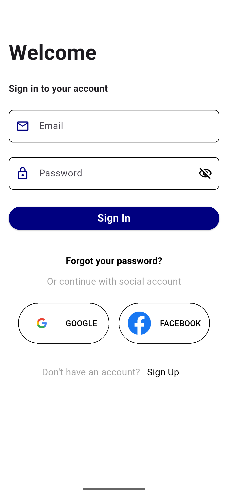
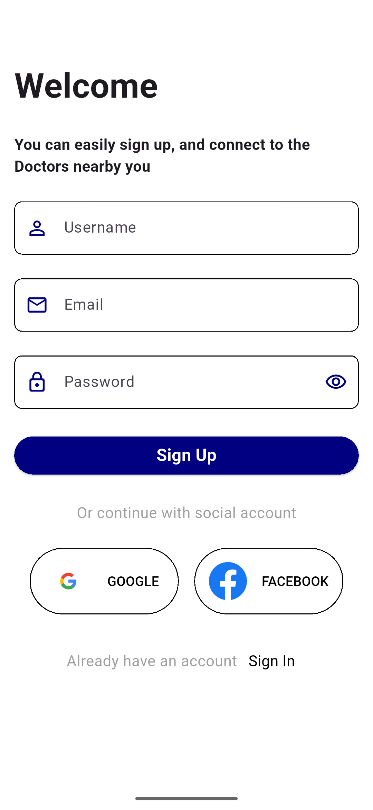
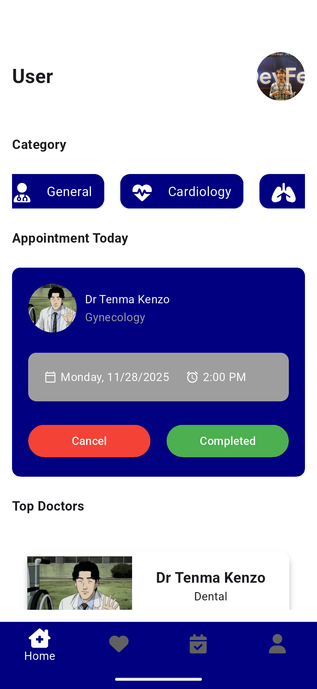

# Doctor Appointment App

## Deskripsi

Ini adalah aplikasi **Doctor Appointment** yang dibuat menggunakan **Flutter** untuk frontend (UI) dan **Laravel** untuk backend. Aplikasi ini dibuat sebagai bagian dari tugas kampus yang diberikan oleh **Pak Dedi Gunawan**. Dalam proses pembuatan aplikasi ini, saya mengikuti tutorial video tanpa penjelasan interaktif, yang menyebabkan saya mengalami **tutorial hell**.

Aplikasi ini memiliki tampilan antarmuka yang sudah selesai, namun backend-nya belum sepenuhnya selesai karena keterbatasan waktu. **Backend** hanya berfungsi untuk proses **login** dan tidak ada fungsionalitas lain yang selesai. Oleh karena itu, repositori ini saya buat sebagai arsip dan bukti pengerjaan tugas.

## Struktur Repository

Di dalam repository ini terdapat dua folder proyek:
- **doctor-app-laravel**: Folder untuk backend yang menggunakan Laravel.
- **doctor_appointment_app**: Folder untuk aplikasi frontend yang menggunakan Flutter.
- **screenshots**: Folder yang berisi screenshot tampilan UI aplikasi.

## Fitur Aplikasi (UI)

Aplikasi ini memiliki beberapa fitur seperti:
- **Login**
- **Register**
- **Home**
- **Doctor Favorite**
- **Doctor Details**
- **Appointment Schedule**
- **User Profile**
- **Booking Screen**
- **Success Booking Screen**

## Screenshots UI

Berikut adalah screenshot beberapa tampilan UI yang telah dibuat pada aplikasi ini:

  
  
  
  
  

  
  
  
  
  

## Demo

Demo aplikasi yang telah saya buat dapat dilihat melalui video YouTube berikut:
- **YouTube Demo**: [Doctor Appointment App Demo | Assigntment](https://youtu.be/UxUwthtbX0s)

## Tutorial dan Referensi

Saya mengikuti tutorial dari video berikut, yang dibuat oleh pemilik tutorial yang sama:
- **YouTube Tutorial**: [Flutter Doctor Appointment App](https://www.youtube.com/watch?v=G2vfT9cFENQ&list=PLU6Jd5r98RCnwTpGjREBhAtASx6Cem_EZ)

Referensi repositori asli yang sudah selesai oleh pemilik tutorial:
- **GitHub Repo Asli**: [TechnoLX/Flutter-Doctor-Appointment-App-With-Laravel](https://github.com/TechnoLX/Flutter-Doctor-Appointment-App-With-Laravel)

## Penutup

Repositori ini saya buat untuk arsip tugas ini, meskipun belum sepenuhnya selesai (terutama bagian backend). Terima kasih telah melihat proyek ini! Semoga proyek ini dapat memberikan gambaran tentang pembuatan aplikasi doctor appointment dengan Flutter dan Laravel.
